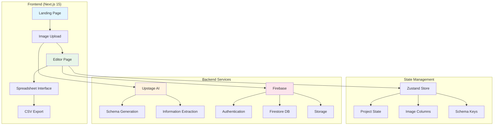
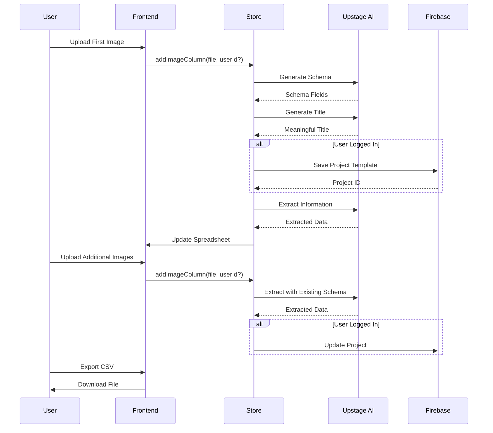

# img2excel - AI-Powered Image to Spreadsheet Converter

**Never Manually Type Data Again.** Turn any image with data into an editable spreadsheet instantly using AI.

[](https://github.com/hunkim/img2excel)
[](LICENSE)
[](https://www.upstage.ai/)

## ✨ Features

- 🤖 **AI-Powered**: Uses [Upstage AI](https://console.upstage.ai/docs/capabilities/information-extraction/universal-information-extraction) for intelligent schema generation and data extraction
- 📸 **Smart Schema Detection**: Automatically detects data structure from your first image
- 🔄 **Adaptive Extraction**: Uses your custom column headers as schema for subsequent images
- 📊 **Real-time Editing**: Edit extracted data in a spreadsheet interface
- 💾 **Project Management**: Save and manage multiple projects with Firebase
- 🔐 **Authentication**: Google Sign-in for project persistence
- 📱 **Responsive Design**: Works on desktop and mobile
- 🎯 **Multiple Formats**: Supports receipts, tables, invoices, lists, and more
- 📈 **CSV Export**: Download your data as CSV files
- 🐛 **Issue Reporting**: Built-in GitHub issue reporting

## 🏗️ Architecture Overview



## 🔄 Business Logic Flow



## 🚀 Quick Start

### Prerequisites

- Node.js 18+ and npm/pnpm
- [Upstage AI API Key](https://console.upstage.ai/)
- [Firebase Project](https://console.firebase.google.com/) (optional, for project persistence)

### Installation

1. **Clone and Install**:
   ```bash
   git clone https://github.com/hunkim/img2excel.git
   cd img2excel
   npm install --legacy-peer-deps
   ```

2. **Configure Environment**:
   Create `.env.local` in the root directory:
   ```env
   # Required: Upstage AI API Key
   UPSTAGE_API_KEY=your_upstage_api_key_here
   
   # Optional: Firebase Configuration (for project persistence)
   NEXT_PUBLIC_FIREBASE_API_KEY=your_firebase_api_key
   NEXT_PUBLIC_FIREBASE_AUTH_DOMAIN=your_project.firebaseapp.com
   NEXT_PUBLIC_FIREBASE_PROJECT_ID=your_project_id
   NEXT_PUBLIC_FIREBASE_STORAGE_BUCKET=your_project.appspot.com
   NEXT_PUBLIC_FIREBASE_MESSAGING_SENDER_ID=123456789
   NEXT_PUBLIC_FIREBASE_APP_ID=1:123456789:web:abcdef
   
   # Optional: Rate Limiting Configuration
   ANONYMOUS_RATE_LIMIT=60        # Requests per hour for non-logged users
   AUTHENTICATED_RATE_LIMIT=240   # Requests per hour for logged users  
   RATE_LIMIT_WINDOW_MS=3600000   # Time window in milliseconds (1 hour)
   ```

3. **Run Development Server**:
   ```bash
   npm run dev
   ```

4. **Open Application**:
   Visit `http://localhost:3000`

## 📋 Usage Examples

### 📄 Receipt Processing
1. Upload a receipt image
2. AI detects: "Item Name", "Price", "Category"
3. Add more receipts - they follow the same schema
4. Export to CSV for expense tracking

### 🧾 Invoice Processing
1. Upload an invoice
2. AI detects: "Description", "Quantity", "Unit Price", "Total"
3. Process multiple invoices consistently
4. Export for accounting

### 📊 Table Digitization
1. Upload a photo of a table/list
2. AI detects column structure
3. Add similar tables with consistent extraction
4. Export structured data

## 🔧 API Integration

### Schema Generation API
```typescript
POST /api/schema-generation
Content-Type: application/json

{
  "imageUrl": "data:image/jpeg;base64,..."
}
```

### Information Extraction API
```typescript
POST /api/information-extraction
Content-Type: application/json

{
  "imageUrl": "data:image/jpeg;base64,...",
  "schema": {
    "type": "object",
    "properties": {
      "field_name": {
        "type": "string",
        "description": "Field description"
      }
    }
  }
}
```

### Schema Naming API
```typescript
POST /api/schema-naming
Content-Type: application/json

{
  "fieldNames": ["field1", "field2", "field3"]
}
```

## 🏛️ Tech Stack

- **Framework**: Next.js 15 with React 19
- **Language**: TypeScript
- **Styling**: Tailwind CSS + shadcn/ui
- **State Management**: Zustand
- **Authentication**: Firebase Auth
- **Database**: Firestore
- **Storage**: Firebase Storage
- **AI Service**: Upstage AI Agentic Information Extraction
- **Deployment**: Vercel

## 📁 Project Structure

```
├── app/
│   ├── api/                    # API routes
│   │   ├── schema-generation/  # AI schema generation
│   │   ├── information-extraction/ # AI data extraction
│   │   └── schema-naming/      # AI title generation
│   ├── editor/                 # Spreadsheet editor page
│   ├── globals.css            # Global styles
│   ├── layout.tsx             # Root layout
│   └── page.tsx               # Landing page
├── components/
│   ├── ui/                    # shadcn/ui components
│   ├── auth-button.tsx        # Authentication component
│   ├── image-uploader.tsx     # Drag & drop upload
│   ├── projects-sidebar.tsx   # Project management
│   └── ...                    # Other components
├── lib/
│   ├── firebase-service.ts    # Firebase operations
│   ├── upstage-service.ts     # AI API integration
│   └── utils.ts               # Utility functions
├── store/
│   └── spreadsheet-store.ts   # Zustand state management
├── hooks/
│   └── useAuth.ts             # Authentication hook
└── public/                    # Static assets
```

## 🔄 v0.3 Improvements

### 📱 Mobile-First Responsive Design
- ✅ **Complete Mobile Optimization**: Fully responsive design while preserving desktop experience
- ✅ **Touch-Friendly Interface**: Proper touch targets and mobile interactions throughout
- ✅ **Smart Sidebar Behavior**: Closed by default on mobile, auto-opens on desktop with projects
- ✅ **Adaptive Layouts**: Responsive sizing for all components (thumbnails, tables, forms)
- ✅ **Enhanced Typography**: Custom breakpoints with scaled text for optimal mobile readability
- ✅ **Performance Optimizations**: Touch manipulation CSS and efficient mobile rendering

### 🎯 Mobile UX Improvements
- ✅ **Overlay Interactions**: Tap outside to close sidebars on mobile
- ✅ **Condensed UI**: Hidden non-essential elements on small screens
- ✅ **Better Spacing**: Optimized padding and margins for touch interfaces
- ✅ **Responsive Icons**: Appropriately scaled icon sizes across breakpoints
- ✅ **Mobile-First Table**: Horizontal scrolling with touch-friendly cells
- ✅ **Progressive Enhancement**: Graceful scaling from mobile (320px) to desktop

## 🔄 v0.2 Improvements

### DRY (Don't Repeat Yourself) Refactoring
- ✅ **Eliminated Redundancy**: Removed 200+ lines of duplicate code
- ✅ **Unified Image Processing**: Single flow for all image uploads
- ✅ **Consolidated Save Logic**: 3 Firebase functions → 1 `saveProject` function
- ✅ **Simplified Authentication**: Clear pattern (logged in = save, not logged in = local only)

### Code Quality Improvements
- ✅ **Clean Logging**: 80% reduction in verbose console output
- ✅ **Better Error Handling**: Essential error logging preserved
- ✅ **Single Responsibility**: Each function has one clear purpose
- ✅ **Production Ready**: No sensitive data in logs

### User Experience Enhancements
- ✅ **Report Issues**: Bug report icons linking to GitHub
- ✅ **Consistent Behavior**: Same upload flow everywhere
- ✅ **Better Performance**: Reduced string processing and console I/O

## 🌍 Environment Variables

| Variable | Description | Required | Default |
|----------|-------------|----------|---------|
| `UPSTAGE_API_KEY` | Your Upstage AI API key | ✅ | - |
| `ANONYMOUS_RATE_LIMIT` | Rate limit for non-logged in users (requests/hour) | ❌ | 60 |
| `AUTHENTICATED_RATE_LIMIT` | Rate limit for logged in users (requests/hour) | ❌ | 240 |
| `RATE_LIMIT_WINDOW_MS` | Rate limit time window in milliseconds | ❌ | 3600000 |
| `NEXT_PUBLIC_FIREBASE_API_KEY` | Firebase API key | ⚠️ Optional* |
| `NEXT_PUBLIC_FIREBASE_AUTH_DOMAIN` | Firebase auth domain | ⚠️ Optional* |
| `NEXT_PUBLIC_FIREBASE_PROJECT_ID` | Firebase project ID | ⚠️ Optional* |
| `NEXT_PUBLIC_FIREBASE_STORAGE_BUCKET` | Firebase storage bucket | ⚠️ Optional* |
| `NEXT_PUBLIC_FIREBASE_MESSAGING_SENDER_ID` | Firebase messaging sender ID | ⚠️ Optional* |
| `NEXT_PUBLIC_FIREBASE_APP_ID` | Firebase app ID | ⚠️ Optional* |

*Firebase variables are optional. Without them, the app works in local-only mode (no project persistence).

## 🤝 Contributing

1. Fork the repository
2. Create a feature branch (`git checkout -b feature/amazing-feature`)
3. Make your changes
4. Test thoroughly
5. Commit your changes (`git commit -m 'Add amazing feature'`)
6. Push to the branch (`git push origin feature/amazing-feature`)
7. Open a Pull Request

### 🐛 Reporting Issues

Found a bug or have a feature request? Please use the built-in issue reporting button in the app header, or visit our [GitHub Issues](https://github.com/hunkim/img2excel/issues) page.

## 📄 License

MIT License - feel free to use for personal or commercial projects.

## 🙏 Acknowledgments

- **[Upstage AI](https://www.upstage.ai/)** - For providing the powerful Agentic Information Extraction API
- **[Vercel](https://vercel.com/)** - For seamless deployment and hosting
- **[Firebase](https://firebase.google.com/)** - For authentication and data storage
- **[shadcn/ui](https://ui.shadcn.com/)** - For beautiful, accessible UI components

---

**Built with ❤️ for productivity** | [Report Issues](https://github.com/hunkim/img2excel/issues) | [Documentation](https://github.com/hunkim/img2excel) 